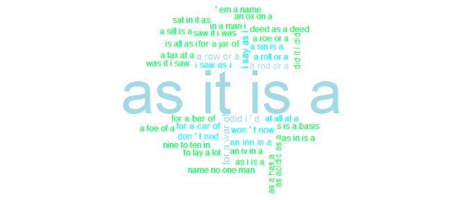
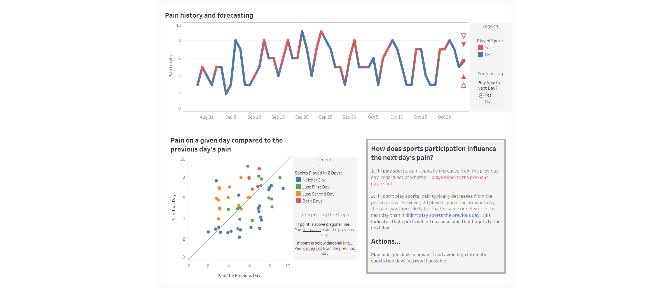

Data Science Portfolio
================
Cooper Schumacher

In addition to my professional work and research as a statistician, I also enjoy taking on data science projects for fun and in order to learn new skills. I have assembled some of these projects into this portfolio.

### Table of Contents:

**The projects can roughly be categorized into the following sections, although many of the skills overlap.**

1.  **Modeling and Machine Learning**
    -   Creating an app to predict dog euthanasia
    -   Predicting product backorders

2.  **Databases and Distributed Computing**
    -   Creating a list of palindrome from the Ngrams dataset on AWS with Apache Hive

3.  **Data Visualization**
    -   D3.js (see my bl.ocks [page](https://bl.ocks.org/coop16))
        -   Soccer Aways Goals Rule Analysis
    -   Tableau
        -   Injury pain levels prediction

 

 

Modeling and Machine Learning
=============================

 

### (1) Creating an app to predict dog euthanasia

| **Primary skills**           | **Primary Programs** |
|------------------------------|----------------------|
| Querying                     | SQL / BigQuery       |
| Data Management and Modeling | R                    |
| Presentation                 | R Shiny, Tableau     |

[Project Write-up / Github Repository](https://github.com/coop16/Dog-Euthanasia-Prediction)

[R Shiny App](https://cooperschumacher.shinyapps.io/DogPrediction/) : hosted on shinyapps.io

[Tableau Story](https://public.tableau.com/profile/cooper.schumacher#!/vizhome/AnimalShelterDogEuthanizationDescriptives/Story1) : hosted on Tableau Public

   

### (2) Predicting Product Backorders

| **Primary skills** | **Primary Programs** |
|--------------------|----------------------|
| Modeling           | Python               |

[Project Write-up / Github Repository](https://github.com/coop16/Backorder-Prediction)

       

Databases and Distributed Computing
===================================

 

### (1) Palindrome Ngrams

| **Primary skills**                 | **Primary Programs**          |
|------------------------------------|-------------------------------|
| Big Data Querying and Manipulation | Apache Hadoop/Hive/Spark, AWS |

[Project Write-up / Github Repository](https://github.com/coop16/Palindrome-Generator)

     

Data Visualization
==================

### (1) Soccer Away Goals Rule Analysis

| Primary skills     | Primary Programs          |
|--------------------|---------------------------|
| Web Scraping       | Python (Selenium library) |
| Data visualization | D3.js                     |

[Visualization](http://bl.ocks.org/coop16/651c862765c96222cc7a7766810bb780) and corresponding Github [Gist](https://gist.github.com/coop16/651c862765c96222cc7a7766810bb780)

[Technical Project Write-up / Github Repository](https://github.com/coop16/Soccer-Away-Goals-Rule-Analysis)

### (3) Injury pain levels

| Primary skills       | Primary Programs |
|----------------------|------------------|
| Data visualization   | Tableau          |
| Time series modeling | R                |

[Project Write-up / Github Repository](https://github.com/coop16/Injury-Pain-Prediction)

[Tableau Dashboard](https://public.tableau.com/views/InjuryPrediction/Dashboard1?:embed=y&:display_count=yes) : hosted on Tableau Public

### (3) Other D3.js Visualizations
See my [bl.ocks page](https://bl.ocks.org/coop16) for more examples!

 

